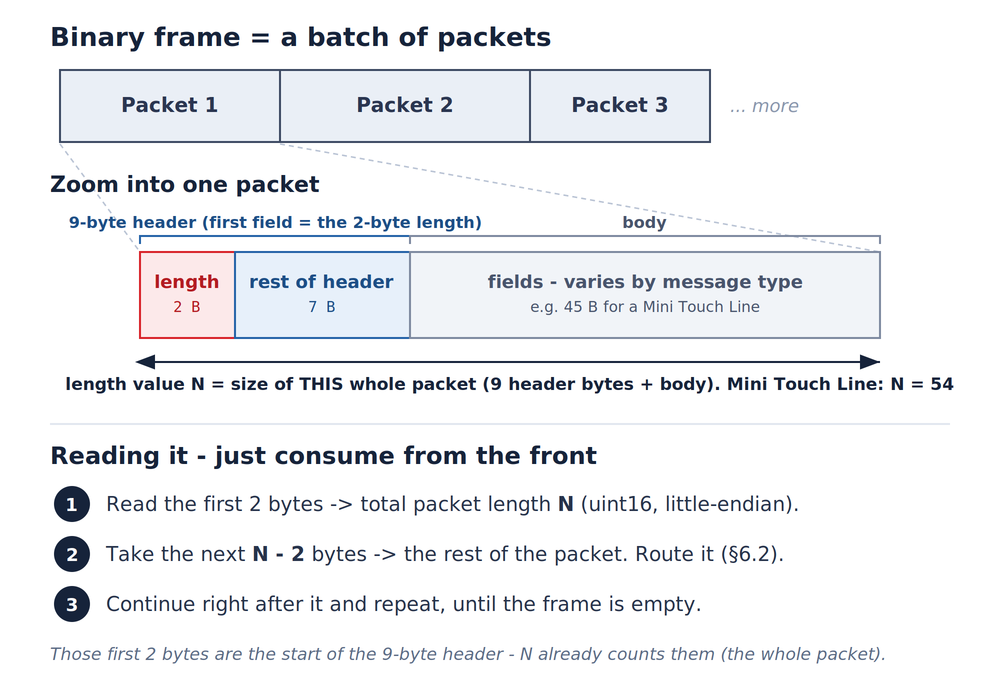

# Market Data WebSocket — Developer Guide

A single WebSocket connection streams live market data (LTP, OHLC, depth, indices,
market open/close). This guide is **language-agnostic**: any language with a WebSocket
library and the ability to read little-endian binary data can implement a client.

It covers the `native_batch` protocol only. If you use the official Python SDK
(`kotakneoapi`), all of the decoding below is done for you — read this when you're
building your own client in another language, or when you want to understand what the
SDK does under the hood.

---

## 1. The mental model

One socket carries **two planes**:

| Plane | Frames | Direction | Used for |
| --- | --- | --- | --- |
| **Control** | JSON **text** | both ways | auth, subscribe, unsubscribe, snapshot, acknowledgements |
| **Data** | **binary** (little-endian, often batched) | server → you | the actual ticks |

Three rules hold everywhere on the data plane:

- **Little-endian** for every multi-byte integer.
- **Packed** structs — no padding between fields (`#pragma pack(1)`).
- **Prices are scaled integers.** You divide by a per-exchange **divider** (from the
  auth response) to get the real value. `1234.56` arrives as `123456` with divider `100`.

Set your socket's binary type to raw bytes (`arraybuffer` or your language's
equivalent) **before** reading data frames.

### The happy path, end to end

1. **Connect** — open the WebSocket.
2. **Authenticate** — send one JSON frame the moment the socket opens.
3. **Store the dividers** from the auth response (keyed by exchange). You need them to
   decode every price later.
4. **Subscribe** — send a JSON frame naming the instrument and the data level you want.
5. **Receive a binary frame** — treat it as a *batch* of packets.
6. **De-frame** it into individual packets (§6.1).
7. **Route** each packet by `message_code` / `level` (§6.2).
8. **Parse** the matching struct (§7).
9. **Scale** prices by the exchange divider; format with `precision`.
10. **Update** your model and render.
11. **On close**, reconnect and repeat from step 2 (re-auth **and** re-subscribe).

---

## 2. Connect

Log in first via the login API (`POST https://mis.kotaksecurities.com/login/1.0/tradeApiValidate`).
Its response returns the endpoints for your account under `data`, including `feedUrl`:

```json
{
  "data": {
    "sid": "...",
    "baseUrl": "...",
    "feedUrl": "...",
    "rtUrl": "..."
  }
}
```

Use **`data.feedUrl`** as the market-data WebSocket endpoint — it is already the correct
feed URL for your account. Switch its scheme from `https` to `wss`, e.g.:

```
https://.../apifeed   ->   wss://.../apifeed
```

No custom HTTP headers or sub-protocols are needed for the handshake;
**authentication happens in the first application message**, not in the handshake.

---

## 3. Authenticate

**Immediately after the socket opens**, send a single JSON text frame:

```json
{
  "user": "ABC87",
  "auth": "daca59eb-caeb-4f9a-ac44-31d427e65b00",
  "format": "native_batch",
  "source": "NEOTRADEAPI",
  "sdk_version": 1.1,
  "sdk_date": "<build date string>"
}
```

| Field | Meaning |
| --- | --- |
| `user` | Your **unique client code (UCC)**. |
| `auth` | Your session token (the `sid` from the login response). |
| `format` | Must be `"native_batch"` for the protocol in this guide. |
| `source` / `platform` | Client identification — must be `"NEOTRADEAPI"`. |
| `sdk_version` / `sdk_date` | SDK / build identifiers (integer / string). |

### The auth response — and why it matters

**Invalid credentials** — the server breaks the socket after sending:

```json
{ "message_code": 1120, "message": "Auth failed ..." }
```

**Successful login** — a JSON text frame with `message_code = 1117`. You may also
receive `message_code = 1119` right after connecting; it carries the same body but
does **not** by itself indicate success or failure — it's useful for initialising your
values early.

Both `1117` and `1119` carry the **dividers**, which you must persist:

```json
{
  "message_code": 1117,
  "id": "<instance name>",
  "format": "native_batch",
  "exchanges": {
    "nse_cm": { "divider": 100 },
    "nse_fo": { "divider": 100 },
    "cde_fo": { "divider": 10000000 }
  }
}
```

Three things to do with this response:

- **Persist `exchanges[*].divider`.** You need the divider for an exchange to decode
  every integer price you later receive for it.
- **Map the exchange *strings* to their *enum values*.** This JSON keys each exchange by
  its name string (`nse_cm`, `nse_fo`, ...), but the binary feed identifies the exchange
  by its **numeric enum** in the packet header (`exchange_id`, e.g. `1` for `nse_cm`) —
  it never sends the name. So store dividers keyed by the enum value, or keep a
  name-value map, so you can look up the right divider from the `exchange_id` byte of an
  incoming packet. The full mapping is in §9.
- **If `format` comes back as `"native_fallback"`,** the server has downgraded you to a
  different body layout that is **out of scope** here — treat it as an error unless you
  have the fallback spec.

> If an exchange is missing from the auth response, default its divider to **100**.

---

## 4. Subscribe, unsubscribe, snapshot

All control messages are JSON text frames of this shape:

```json
{ "event": "<event>", "inputtoken": "<exchange>|<token>" }
```

- **`inputtoken`** = `"<exchange_string>|<token>"`, e.g. `"nse_cm|11536"`. The token may
  be a numeric scrip code or an index/instrument name (e.g. `"nse_cm|Nifty 50"`).
  Exchange strings are in §9.
- **Batching** — to subscribe to many instruments at once, send them as a
  comma-separated `inputtoken` (e.g. `"nse_fo|44498,nse_fo|44500,..."`) in a single
  frame. This is the efficient way to subscribe a whole option chain.
- **`ack_symbol`** *(optional)* — set `true` to have the server return the human-readable
  trading symbol in the subscription acknowledgement (§5). The binary feed itself never
  carries the symbol, so include this if you want it.
- **Snapshot** requests the current full state **once**. Its reply uses the **same binary
  message types** as the live feed (§7).

The exact `event` value depends on the data **level** (depth) you want, or whether the
instrument is an index:

| Intent | Level | subscribe event | unsubscribe event | snapshot event |
| --- | --- | --- | --- | --- |
| Index | — (type = Index) | `subscribeIndices` | `unsubscribeIndices` | `snapshotIndices` |
| Depth | 8 | `subscribeDepth` | `unsubscribeDepth` | `snapshotDepth` |
| Touch line | 4 | `subscribeScrips` | `unsubscribeScrips` | `snapshotScrips` |
| Mini touch line | 1 (default) | `subscribeScripsLite` | `unsubscribeScripsLite` | `snapshotScripsLite` |

### Examples

```json
{ "event": "subscribeScrips",     "inputtoken": "nse_cm|11536" }
{ "event": "subscribeDepth",      "inputtoken": "nse_fo|49081" }
{ "event": "snapshotScrips",      "inputtoken": "nse_cm|11536" }
{ "event": "unsubscribeScrips",   "inputtoken": "nse_cm|11536" }
{ "event": "subscribeIndices",    "inputtoken": "nse_cm|26000" }
```

### Subscription limit

A client may hold at most **3000 input tokens** subscribed at once. This is a **running
total across every subscribe request** — LTP, option chains, indices, and depth all draw
from the same budget. Unsubscribing frees budget. Re-subscribing an already-subscribed
token does not count twice.

---

## 5. Subscription acknowledgement

When you subscribe (with `ack_symbol: true`), the server replies with a JSON text frame,
`message_code = 1109`:

```json
{
  "message_code": 1109,
  "error_code": 0,
  "description": "SUBSCRIBED",
  "data": {
    "nse_cm|1333": {
      "cas_status": 1,
      "trading_symbols": "HDFCBANK-EQ"
    }
  }
}
```

- `data` is keyed by the instrument you subscribed with; the value holds its details.
- `trading_symbols` is the human-readable symbol (e.g. `HDFCBANK-EQ`) — **the only place
  you get it**, since the binary feed carries only the numeric token. Capture it here and
  stamp it onto the ticks you decode for that instrument.
- `cas_status` is `1` for scrips eligible for CAS, `0` otherwise.

> **This acknowledgement is not guaranteed to arrive before the first tick** for the
> instrument. Don't block your tick handling on it — resolve the symbol lazily. (The
> Python SDK briefly withholds a symbol-less instrument's ticks until the ack lands,
> keeping only the latest tick per instrument in the meantime; replicate that only if you
> need every message pre-stamped with a symbol.)

---

## 6. Receiving binary data

### 6.1 De-frame the batch

One binary frame is a **batch**: several packets laid end to end, with no separators.
Instead, **each packet begins with its own 2-byte length** — and those 2 bytes are the
first field of the packet's 9-byte header, not something extra in front of it. The length
counts the **whole** packet (all 9 header bytes + body). So you never track running
offsets — you just consume the frame from the front, one packet at a time:



1. Read the first **2 bytes** — the packet's total length `N` (`uint16`, little-endian).
   These 2 bytes are the start of the 9-byte header, and `N` already counts them.
2. Take the next **`N - 2` bytes** — the rest of the packet (the remaining 7 header bytes
   + body). The 2 length bytes plus these `N - 2` bytes are one whole packet of `N` bytes.
   Route it (§6.2).
3. Continue right after that packet and repeat, until the frame is empty.

If the final chunk is shorter than its own declared length (a truncated tail), stop and
skip it. In code (slicing `N` bytes from the start re-includes the 2 length bytes, so it's
equivalent to reading 2 then `N - 2`):

```
offset = 0
while offset + 2 <= frame.length:
    size = read_u16_le(frame, offset)      # total packet length N (incl. these 2 bytes)
    if offset + size > frame.length:
        break                              # truncated tail -- stop
    handle(frame[offset : offset + size])  # the whole N-byte packet -- route + decode (§6.2)
    offset += size
```

### 6.2 Route each packet

From each packet's header, read `message_code` (uint16 LE at offset 2) and `level`
(uint8 at offset 5), then dispatch **in this order**:

| Condition (checked in order) | Packet type | Struct |
| --- | --- | --- |
| `message_code == 7207` | Index | §7.2 |
| `message_code == 105` | Market Status | §7.5 |
| `message_code == 104` | CAS Reference | §7.6 |
| `level == 1` | Mini Touch Line | §7.4 |
| `level in {2, 4, 8}` | Market Picture (full) | §7.3 |
| otherwise | ignore | — |

> **Route market-data packets by the `level` byte, not by `message_code`.** Both the
> Mini Touch Line and the full Market Picture arrive with `message_code == 7208`; only
> `level` tells them apart. For `level == 4` (touch line), treat the depth as exactly
> **1 bid + 1 ask** regardless of the counts in the body.

### 6.3 Decode rules

These apply to every struct in §7:

- **Endianness / packing** — all integers little-endian; structs packed, no padding.
- **Prices** are scaled integers — **display value = raw / divider** (per exchange, from
  the auth response).
- **`net_chg_percent`** is scaled by **100** — display = raw / 100 (independent of the
  divider).
- **`net_chg`** is scaled by the **divider** — display = raw / divider.
- **`precision`** (when present) is the number of decimal places to format the value to.
- **Strings** are fixed-size UTF-8 byte arrays, **NUL-padded**. Decode up to the first
  `\0` (or the array end) and trim surrounding whitespace.
- **Timestamps** are integer epoch values exactly as the exchange sends them. Treat them
  as opaque 64-bit integers unless you know the exchange's epoch/units.
- **Fields named with a leading underscore** (e.g. `_market_cap`) are present on the wire
  but unused by the reference client. They're documented so your byte offsets line up —
  read past them, don't rely on them.

---

## 7. Wire structures

All structures are little-endian and packed. Offsets (`@n`) are byte positions from the
start of the packet. `/ divider` marks a scaled price.

### 7.1 Common header — every binary packet (9 bytes)

The 9-byte header **includes** the 2-byte length: `message_length` is its first field,
and it counts the whole packet (all 9 header bytes + body). So a Mini Touch Line is a
9-byte header + a 45-byte body = 54 bytes, and its `message_length` reads `54`.

| `@` | Type | Field | Notes |
| --- | --- | --- | --- |
| 0 | uint16 | `message_length` | total packet size incl. these 2 bytes + the rest of the header + body (also the de-frame length) |
| 2 | uint16 | `message_code` | 7207 index · 7208 market picture · 105 market status · 104 CAS |
| 4 | int8 | `exchange_id` | enum Exchange (§9) |
| 5 | uint8 | `level` | enum Level (§9) |
| 6 | uint8 | `reserved` | reserved — auction is not currently enabled |
| 7 | uint8 | `seq_no` | sequence number (informational in this mode) |
| 8 | uint8 | `bitmask_length` | 0 for `native_batch` full messages |

### 7.2 Index message — `message_code == 7207` (87 bytes)

| `@` | Type | Field | Notes |
| --- | --- | --- | --- |
| 0 | — | `hdr` | common header (9 bytes) |
| 9 | uint32 | `token` | instrument token |
| 13 | int32 | `open_price` | / divider |
| 17 | int32 | `close_price` | / divider (previous close / closing index) |
| 21 | int32 | `high_price` | / divider |
| 25 | int32 | `low_price` | / divider |
| 29 | int32 | `index_value` | / divider (current value / LTP) |
| 33 | uint64 | `last_trade_time` | epoch |
| 41 | int32 | `yearly_high` | / divider |
| 45 | int32 | `yearly_low` | / divider |
| 49 | int32 | `net_chg_percent` | / 100 |
| 53 | double (f64) | `_market_cap` | present, unused |
| 61 | uint8 | `precision` | decimal places for display |
| 62 | int32 | `multiplier` | / divider (unused) |
| 66 | char[21] | `name` | index name, UTF-8, NUL-padded |

Derived value: `change = index_value - close_price`.

### 7.3 Market Picture (full) — `message_code == 7208`, `level in {2, 4, 8}`

A **144-byte fixed body**, followed by `buy_depth_count + sell_depth_count` depth rows.
The first `buy_depth_count` rows are **bids (buy)**; the remaining `sell_depth_count` rows
are **asks (sell)**.

| `@` | Type | Field | Notes |
| --- | --- | --- | --- |
| 0 | — | `hdr` | common header (9 bytes) |
| 9 | uint32 | `token` | |
| 13 | int64 | `total_buy_qty` | |
| 21 | int64 | `total_sell_qty` | |
| 29 | int64 | `volume_traded_today` | |
| 37 | int64 | `last_trade_time` | epoch |
| 45 | int64 | `last_update_time` | epoch |
| 53 | uint32 | `open_price` | / divider |
| 57 | uint32 | `close_price` | / divider |
| 61 | uint32 | `high_price` | / divider |
| 65 | uint32 | `low_price` | / divider |
| 69 | uint32 | `last_traded_price` | / divider |
| 73 | int64 | `last_trade_qty` | |
| 81 | uint32 | `avg_trade_price` | / divider |
| 85 | uint32 | `_indicative_close` | present, unused |
| 89 | uint32 | `buy_depth_count` | number of bid rows that follow |
| 93 | uint32 | `sell_depth_count` | number of ask rows that follow |
| 97 | int16 | `_trading_status` | present, unused |
| 99 | int32 | `net_chg_percent` | / 100 |
| 103 | uint32 | `open_interest` | |
| 107 | double (f64) | `total_traded_value` | / divider |
| 115 | int32 | `net_chg` | / divider |
| 119 | uint32 | `upper_circuit` | / divider |
| 123 | uint32 | `lower_circuit` | / divider |
| 127 | uint32 | `yearly_high` | / divider |
| 131 | uint32 | `yearly_low` | / divider |
| 135 | uint32 | `market_lot` | |
| 139 | uint8 | `precision` | |
| 140 | uint32 | `multiplier` | |
| 144 | DepthRow[...] | `depth` | `buy_depth_count + sell_depth_count` rows |

**DepthRow — 16 bytes each** (offsets within the row):

| `@` | Type | Field | Notes |
| --- | --- | --- | --- |
| 0 | int64 | `qty` | |
| 8 | int32 | `price` | / divider |
| 12 | int32 | `number_of_orders` | |

**Reading the depth rows:** start at offset 144 and read
`buy_depth_count + sell_depth_count` rows, **but stop early if you reach
`hdr.message_length`** — a packet may carry fewer rows than the counts imply. And for
`level == 4` (touch line), force the counts to **1 bid + 1 ask** regardless of the values
in `buy_depth_count` / `sell_depth_count`.

### 7.4 Mini Touch Line — `message_code == 7208`, `level == 1` (54 bytes)

A compact message with no depth rows.

| `@` | Type | Field | Notes |
| --- | --- | --- | --- |
| 0 | — | `hdr` | common header (9 bytes) |
| 9 | uint32 | `token` | |
| 13 | int64 | `last_trade_time` | epoch |
| 21 | uint32 | `last_traded_price` | / divider |
| 25 | int64 | `last_trade_qty` | |
| 33 | uint32 | `close_price` | **NOT divided** — see quirk below |
| 37 | int32 | `net_chg_percent` | / 100 |
| 41 | int32 | `net_chg` | / divider |
| 45 | uint32 | `market_lot` | |
| 49 | uint8 | `precision` | |
| 50 | uint32 | `multiplier` | |

> **Quirk:** in the reference client, `close_price` in *this* message is used **as-is and
> is NOT scaled by the divider**, unlike every other price. Reproduce this behaviour to
> match the reference — or apply the divider only if you determine the raw value is
> actually scaled.

### 7.5 Market status — `message_code == 105` (16 bytes)

Session / segment status notifications (open, close, pre-open, CAS transitions, etc.). The
9-byte header's `exchange_id` identifies the segment; `status_code` says what happened.
This replaces the earlier market open/close codes — an open now arrives as
`status_code = 1`, a close as `status_code = 2`.

| `@` | Type | Field | Notes |
| --- | --- | --- | --- |
| 0 | — | `hdr` | common header (9 bytes); `message_code == 105` |
| 9 | uint16 | `status_code` | one of the values below |
| 11 | char[5] | `status` | short status label, UTF-8, NUL-padded |

Total: **16 bytes**.

`status_code` values:

| Value | Name | | Value | Name |
| --- | --- | --- | --- | --- |
| 1 | `OpenMessage` | | 7 | `ClosingEnd` |
| 2 | `CloseMessage` | | 8 | `CtsCloseForCas` |
| 3 | `PreopenShutdownMsg` | | 9 | `RevisedPriceBandCompleted` |
| 4 | `NormalMktPreopenEnded` | | 10 | `CasStart` |
| 5 | `AuctionStatusChange` | | 11 | `MarketOrderRestricted` |
| 6 | `ClosingStart` | | 12 | `CasEnd` |

### 7.6 CAS Reference — `message_code == 104` (48 bytes)

Sent during a **CAS (Call Auction Session)**; carries the pre-auction imbalance for an
instrument.

| `@` | Type | Field | Notes |
| --- | --- | --- | --- |
| 0 | — | `hdr` | common header (9 bytes); `message_code == 104` |
| 9 | int32 | `token` | instrument token (source: `nToken`) |
| 13 | int32 | `ref_price` | reference price (`nRefPrice`) — see note |
| 17 | int64 | `imbalance_qty` | order imbalance qty (`nImbalanceQty`) |
| 25 | int64 | `imbalance_qty_at_mkt` | imbalance qty at market (`nImbalanceQtyAtMkt`) |
| 33 | char[15] | `reserved` | reserved / unused (`sReserved`) |

Total: **48 bytes** (assuming the standard 9-byte header).

---

## 8. Reconnect & lifecycle

- **Error during connect** — the connection failed; surface it and retry.
- **Close** — reconnect from scratch: re-open, **re-authenticate**, and **re-send all
  your subscriptions**. The server does **not** remember subscriptions across
  connections.
- **Heartbeat** — there is no application-level ping/pong in this mode. Rely on the
  WebSocket layer's native ping/pong to keep the connection alive.

A robust client keeps its own list of active subscriptions so it can replay them after a
reconnect, and re-stores the dividers from the fresh auth response each time.

---

## 9. Reference

### Exchange enum (`exchange_id`, transmitted as a signed byte)

| Value | Enum | String |
| --- | --- | --- |
| 0 | `NONE` | `none` |
| 1 | `NSE_CM` | `nse_cm` |
| 2 | `NSE_FO` | `nse_fo` |
| 3 | `CDE_FO` | `cde_fo` |
| 4 | `NSE_COM` | `nse_com` |
| 5 | `BSE_CM` | `bse_cm` |
| 6 | `BSE_FO` | `bse_fo` |
| 7 | `BSE_CD` | `bse_cd` |
| 8 | `BSE_CO` | `bse_co` |
| 9 | `MCX_FO` | `mcx_fo` |
| 10 | `NCD_CO` | `ncd_co` |

### Level enum (`level`, transmitted as a uint8)

| Value | Enum |
| --- | --- |
| 1 | `MINI_TOUCH_LINE` |
| 4 | `TOUCH_LINE` |
| 8 | `DEPTH` |

### Message codes

| Code | Meaning | Frame type |
| --- | --- | --- |
| 104 | CAS reference | binary |
| 105 | Market status | binary |
| 1109 | Subscription response | JSON text |
| 1117 | Auth response (success) | JSON text |
| 1119 | Initial connect response | JSON text |
| 1120 | Auth failed | JSON text |
| 7207 | Index data | binary |
| 7208 | Market picture / mini touch line | binary (route by `level`) |

### Dividers (price scale)

Always prefer the divider delivered in the auth response. Typical values:

| Exchange | Divider |
| --- | --- |
| NSE_CM, NSE_FO, BSE_CM, BSE_FO, MCX_FO | 100 |
| NSE_COM, BSE_CO | 10,000 |
| CDE_FO, BSE_CD | 10,000,000 |
| NCD_CO | 1 |
| *(missing from auth response)* | default 100 |

### A normalized model (optional but convenient)

It's convenient to decode every message type into one normalized record for your UI.
Suggested fields: `token`, `exchange`, `symbol`/`name`, `ltp` (= `index_value` for
indices), `ltt`/`lut`/`ltq`, `atp`, `open`/`high`/`low`/`close`, `net_chg`/
`net_chg_percent`, `oi`, `volume_traded_today`, `total_buy_qty`/`total_sell_qty`,
`buy[]`/`sell[]` (arrays of `{ qty, price, no_of_orders }`), `isIndex`,
`upperCircuit`/`lowerCircuit`, `yearlyHigh`/`yearlyLow`,
`traded_value`.

Suggested map key, so updates replace prior state for the same instrument:

| Case | Key |
| --- | --- |
| Index (`isIndex`) | `exchange \| name` |
| Otherwise | `exchange \| token` |

---

## 10. Worked example — decoding a Mini Touch Line packet

A single 54-byte packet in one frame, exchange `nse_cm` (divider = **100**). Bytes are
shown in order, offset-prefixed:

```
   0: 36 00 28 1c 01 01 00 07 00 10 2d 00 00 80 26 b4
  16: 68 00 00 00 00 40 e2 01 00 32 00 00 00 00 00 00
  32: 00 90 dc 01 00 77 00 00 00 b0 05 00 00 01 00 00
  48: 00 02 01 00 00 00
```

Walk it field by field (all little-endian):

| Bytes `@` | Raw (LE) | Field | Value |
| --- | --- | --- | --- |
| 0-1 | `36 00` | `message_length` | 54 — this packet is 54 bytes |
| 2-3 | `28 1c` | `message_code` | 7208 |
| 4 | `01` | `exchange_id` | 1 = `nse_cm` |
| 5 | `01` | `level` | 1 = `MINI_TOUCH_LINE` — route here |
| 9-12 | `10 2d 00 00` | `token` | 11536 |
| 21-24 | `40 e2 01 00` | `last_traded_price` | 123456 — **123456 / 100 = 1234.56** |
| 33-36 | `90 dc 01 00` | `close_price` | 122000 — **used as-is = 122000** (the quirk) |
| 37-40 | `77 00 00 00` | `net_chg_percent` | 119 — **119 / 100 = 1.19 %** |
| 41-44 | `b0 05 00 00` | `net_chg` | 1456 — **1456 / 100 = 14.56** |

Note how `last_traded_price` and `net_chg` use the divider (100) while `net_chg_percent`
uses 100 unconditionally and `close_price` uses **neither** — exactly the rules in §6.3
and the §7.4 quirk.
